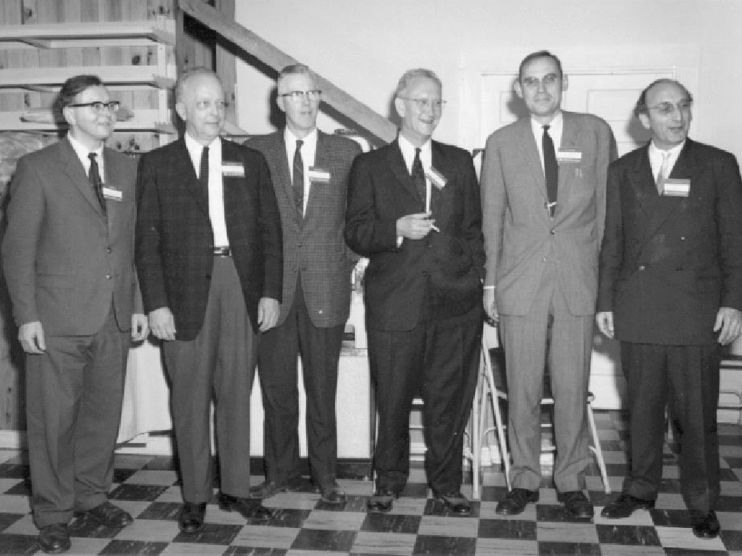

# Algebra Lineal Computacional

Recursos de la materia "Algebra Lineal Computacional" para la Licenciatura en Ciencias de Datos de la UBA, dictada en 2C2024 por Javier Etcheverry.

(De izquierda a derecha) A. S. Householder, J. H. Wilkinson, G. Forsythe, G. H. Golub, C. Moler, J. Todd

